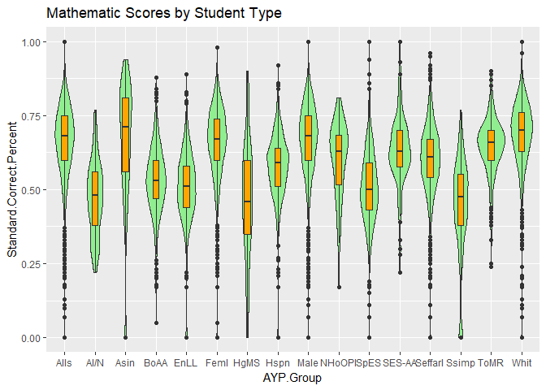
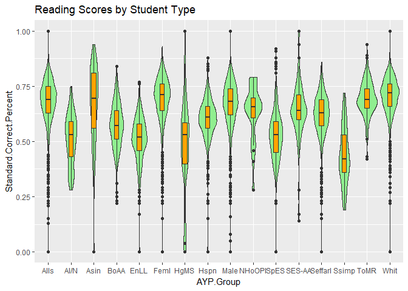
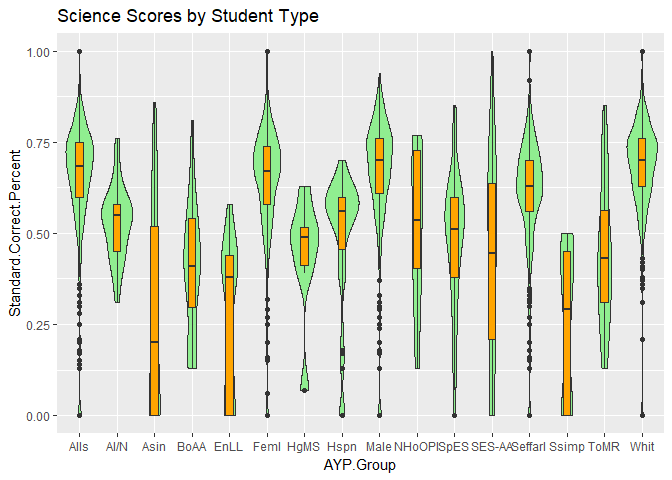
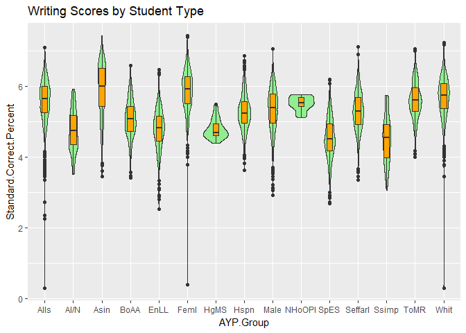

Team Bazinga: R Plot Data Analysis
================

Set 1 Data Plot 1: All Scores by Subject
----------------------------------------

This plot represents the entire Set 1 data. As you will notice the grading scale for each subject is not identical, so we need to evaluate the subjects separetly by splitting the data. The graph depicts a Boxplot overlayied a Violin plot. Nothing can be determined by this graph, this will just be an inital level set of the data we are working with.

    ## Warning: package 'ggplot2' was built under R version 3.4.2

Set 1 Data Plot 2: Math scores by Student Demographic
-----------------------------------------------------

After we split the data by Subject, the first Subject to be evaluated is Mathematics. This graph displays the Boxplot and Violin graph for all the Student demographics, which include the following Student Types.

-   All students
-   American Indian/Alaska Native
-   Asian
-   Black or African American
-   English Language Learners
-   Female
-   Highly Mobile Students
-   Hispanic
-   Male
-   Native Hawaiian or Other Pacific Islander
-   Special Education Students
-   Special Education Students - Alternate Assessment
-   Students eligible for free and reduced lunch
-   Students served in migrant programs
-   Two or More Races
-   White

The labels on the graph have been abbrevated to fit, and are a bit difficult to read, but the graph is in alphabetical order as the list is above.

The Box Plot has been overlayed with a violin graph to check for any Bimodal situations that would cause us to believe the data is not normalaized. The graph seems to show that the data for each student type appears to be normal.

The results of the Boxplot appears to show the highest scoring demographic in the subject area of Mathmatics is Asian students, followed by White, followed by Males, followed by Females.

Set 1 Data Plot 3: Reading scores by Student Demographic
--------------------------------------------------------

After we split the data by Subject, the second Subject to be evaluated is Reading. This graph displays the Boxplot and Violin graph for all the Student demographics, which include the following Student Types.

-   All students
-   American Indian/Alaska Native
-   Asian
-   Black or African American
-   English Language Learners
-   Female
-   Highly Mobile Students
-   Hispanic
-   Male
-   Native Hawaiian or Other Pacific Islander
-   Special Education Students
-   Special Education Students - Alternate Assessment
-   Students eligible for free and reduced lunch
-   Students served in migrant programs
-   Two or More Races
-   White

The lables on the graph have been abbrevated to fit, and are a bit difficult to read, but the graph is in alphabetical order as the list is above.

The Box Plot has been overlayed with a violin graph to check for any Bimodal situations that would cause us to believe the data is not normalaized. The graph seems to show that the data for each student type appears to be normal, with the exception of Highly Mobile Students and Native Hawaiian. Towards the bottom there does appear to be a surge of increasing values that would cause the data to be a bit skewed.

The results of the Boxplot appears to show the highest scoring demographic in the subject area of Reading is White students, followed by Female, followed by Asian, followed by Two or More Races. Males came in 5th.

Set 1 Data Plot 4: Science scores by Student Demographic
--------------------------------------------------------

After we split the data by Subject, the third Subject to be evaluated is Science. This graph displays the Boxplot and Violin graph for all the Student demographics, which include the following Student Types.

-   All students
-   American Indian/Alaska Native
-   Asian
-   Black or African American
-   English Language Learners
-   Female
-   Highly Mobile Students
-   Hispanic
-   Male
-   Native Hawaiian or Other Pacific Islander
-   Special Education Students
-   Special Education Students - Alternate Assessment
-   Students eligible for free and reduced lunch
-   Students served in migrant programs
-   Two or More Races
-   White

The lables on the graph have been abbrevated to fit, and are a bit difficult to read, but the graph is in alphabetical order as the list is above.

The Box Plot has been overlayed with a violin graph to check for any Bimodal situations that would cause us to believe the data is not normalaized. The graph seems to show that the data for each student type appears to be normal, except for Highly Mobile Students and Hispanic students. There seems to be a surge of increases values clustering towards the bottom, which could weight down the Average.

The results of the Boxplot appears to show the highest scoring demographic in the subject area of Science is White students and or Male students (there seems to be a tie), followed by Female, followed by Students eligible for a free and reduced lunch, followed by Hispanic. There also appears to be a significant reduction in the scores for Asian, English Language Learners, and Students served in migrant programs. The first quartile appears to be pulled to the bottom of the graph.

Set 1 Data Plot 5: Writing scores by Student Demographic
--------------------------------------------------------

After we split the data by Subject, the fourth Subject to be evaluated is Writing. This graph displays the Boxplot and Violin graph for all the Student demographics, which include the following Student Types.

-   All students
-   American Indian/Alaska Native
-   Asian
-   Black or African American
-   English Language Learners
-   Female
-   Highly Mobile Students
-   Hispanic
-   Male
-   Native Hawaiian or Other Pacific Islander
-   Special Education Students
-   Special Education Students - Alternate Assessment
-   Students eligible for free and reduced lunch
-   Students served in migrant programs
-   Two or More Races
-   White

The lables on the graph have been abbrevated to fit, and are a bit difficult to read, but the graph is in alphabetical order as the list is above.

The Box Plot has been overlayed with a violin graph to check for any Bimodal situations that would cause us to believe the data is not normalaized. The graph seems to show that the data for each student type appears to be normal.

The results of the Boxplot appears to show the highest scoring demographic in the subject area of Writing is Asian students, followed by Females, followed by White, followed by Two or More Races.

